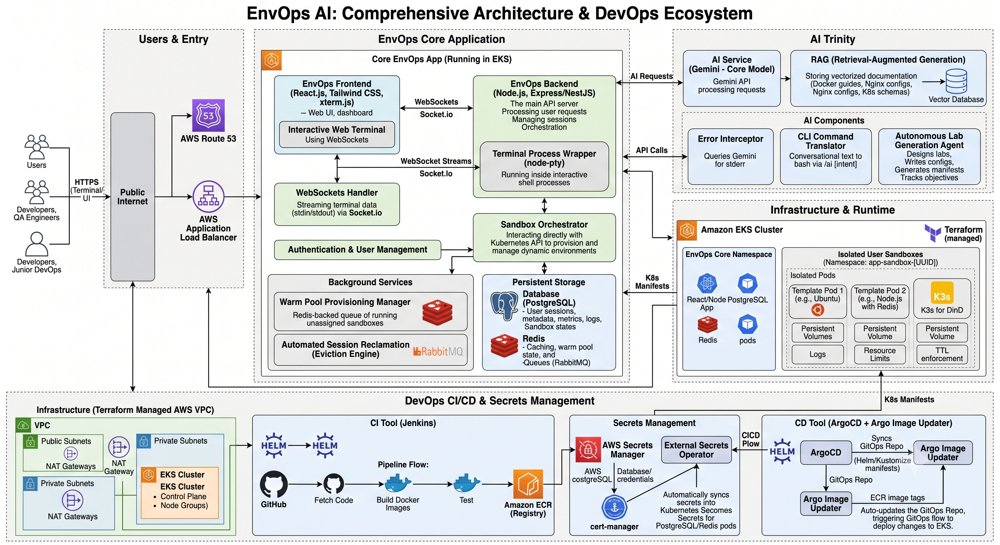

# EnvOps

> Dynamic, cloud-native development sandboxes on demand.

EnvOps is a microservices-based platform designed to provision, manage, and connect to isolated Kubernetes-based development environments in seconds. It provides developers with secure, ephemeral sandboxes complete with real-time web terminal access directly from the browser.

---

## Architecture Overview

The system is decoupled into three primary execution layers: React client, Node.js control plane, and an AWS EKS infrastructure bedrock.




## Core Features

* **Dynamic Kubernetes Provisioning:** Automated generation of Namespaces, Pods, and Network Policies via the Kubernetes Node SDK.
* **Hardened-by-Default Security Contexts:** Sandboxes run non-root and drop all Linux capabilities (`ALL`); trusted runtime templates (e.g. Docker-in-Docker, k3s) opt into a privileged context only where the image requires it.
* **TTL-based Sandbox Lifecycle:** Every sandbox carries an expiration (TTL). Expired sandboxes are marked `expired`, their Kubernetes resources are evicted on a scheduled sweep, and the terminal Connect action is disabled.
* **Customizable Sandboxes:** Per-sandbox CPU/memory and TTL overrides (clamped to platform bounds) across curated templates — Ubuntu, Rich Linux, Docker-in-Docker, and a single-node k3s cluster.
* **Real-time Web Terminal:** Low-latency standard I/O streaming using WebSocket streams, `node-pty`, and `xterm.js`.
* **AI Error Interpreter:** Terminal stderr is scanned for common failure signatures and explained by DeepSeek (via the ITI gateway) with suggested fixes.
* **Infrastructure as Code (IaC):** 100% codified AWS networking (VPC, NAT) and Kubernetes (EKS) infrastructure using Terraform.
* **Local Cloud Emulation:** Full local testing capabilities utilizing Docker and Floci (AWS Emulator), completely eliminating cloud costs during development.

## Tech Stack

| Component | Technology |
| --- | --- |
| **Frontend** | React 18, TypeScript, Vite, Tailwind CSS, xterm.js, lucide-react, react-markdown |
| **Backend** | Node.js, Express, Socket.IO, Prisma ORM, PostgreSQL, Redis |
| **Infrastructure** | Terraform, AWS (EKS, VPC, IAM), Kubernetes Client SDK |
| **Local Dev** | Docker Compose, Floci (AWS Emulator) |

<!-- ## Repository Structure

```text
.
├── apps/
│   └── backend/          # Node.js API, Prisma Schema, K8s Orchestrator, WebSockets
├── frontend/             # React SPA, Tailwind, Vite, xterm.js UI
├── Terraform/            # AWS IaC (VPC, EKS, IAM, Backend State)
│   ├── Modules/          # Reusable standard modules
│   └── envs/             # Environment specific configurations
└── Docker/               # Local emulation compose files (Postgres, Redis, Floci)

``` 

--- -->

## Getting Started (Local Development)

### Prerequisites

* Docker & Docker Compose
* Node.js (v18+)
* Terraform CLI (v1.5+)

### 1. Spin up Local Services

The provided Docker Compose file initializes Postgres, Redis, and the Floci AWS emulator.

```bash
cd Docker
docker compose up -d

```

### 2. Configure the Backend

Install dependencies and run database migrations.

```bash
cd apps/backend
npm install
cp .env.example .env
npx prisma migrate dev
npm run prisma:seed
npm run dev

```

Set `KUBERNETES_TARGET=emulator` for Floci or `KUBERNETES_TARGET=aws` when the backend should talk to a real EKS kubeconfig.

> **Note:** `prisma migrate dev` auto-seeds only when new migrations are applied. Running `npm run prisma:seed` explicitly ensures the demo user and all sandbox templates (Ubuntu, Rich Linux, Docker, Kubernetes) exist — without them the dashboard's *New Sandbox* flow has no templates to offer.

`EVICTION_INTERVAL_MS` (default `60000`) controls how often the backend sweeps for expired sandboxes, marking them `expired` and removing their Kubernetes resources.

### 3. Launch the Frontend

Install UI dependencies and start the Vite development server.

```bash
cd frontend
npm install
cp .env.example .env
npm run dev

```

---

## Infrastructure Deployment

The `Terraform/` directory contains the modularized IaC for AWS. It is designed to work with both real AWS environments and local emulators via override files.

### Automated cloud database setup

The cloud data plane is automated end-to-end: AWS Secrets Manager holds the
credentials, Terraform installs External Secrets Operator with IRSA, ESO
creates Kubernetes Secrets, Helm deploys persistent PostgreSQL and Redis, and
Argo CD runs Prisma migrations and the idempotent seed before each backend
rollout. No password is committed to the repository or supplied as a Terraform
variable.

After Terraform has deployed EKS, the EBS CSI driver, IRSA, and External Secrets Operator, run the
bootstrap once for the new environment:

```bash
cd EnvOps
./scripts/bootstrap-cloud-database.sh
```

It retains existing AWS secrets, so
it is safe to re-run after an interrupted bootstrap. Password rotation is
intentionally separate: update the two AWS Secrets Manager values and let ESO
refresh the Kubernetes Secrets; do not place rotated values in Git or Terraform
state.

Verify the deployed state without displaying credentials:

```bash
./scripts/test-cloud-database.sh
```

It runs `SELECT 1` inside the real backend container using its injected
`DATABASE_URL`, without showing the credential.

After the verification passes, push the backend image to ECR, then enable the
rest of the GitOps stack with the usual full Terraform apply:

```bash
cd Terraform
terraform apply -var-file="envs/prod.tfvars"
```

This ordering ensures Argo CD does not run the migration and seed Jobs until
the database is ready and the backend image is available.

### Database migrations

Database migrations run automatically during every Argo CD sync. The
`envops-backend-migrate` Job is a `PreSync` hook that runs
`npx prisma migrate deploy` from the backend image before the backend Deployment
is updated. It uses the same ConfigMap plus the ESO-managed PostgreSQL and
Redis Secrets as the API. The following `PreSync` seed Job uses Prisma upserts,
so reference data is restored safely on every sync.

If a migration fails, Argo CD stops the sync and leaves the current backend
Deployment in place. Successful migration Jobs are removed automatically; failed
Jobs are retained for up to 24 hours for troubleshooting.

### Deploying to Local Emulator (Floci)

If you are developing locally, ensure your `floci_override.tf` is present (this file is git-ignored to prevent polluting production).

*Note: Due to local emulator concurrency limitations, it is strictly recommended to apply the VPC module first, followed by the EKS module sequentially.*

```bash
cd Terraform
terraform init

# 1. Build Network Foundation (Sequential)
terraform apply -target=module.vpc -var-file="envs/dev.tfvars" -parallelism=1

# 2. Build EKS Control Plane & Nodes (Sequential)
terraform apply -var-file="envs/dev.tfvars" -parallelism=1

```

### Deploying to AWS

Remove the local override file and execute using standard AWS credentials.

```bash
cd Terraform
terraform init
terraform apply -var-file="envs/prod.tfvars"

```

## The Team

EnvOps is collaboratively developed by:

* **Ahmed Bakry (Infrastructure & Orchestration):** Terraform EKS/VPC modules, K8s SDK integration, Pod Security Policies.
* **Rana (Backend API & Data):** Express controllers, Prisma schemas, REST architecture.
* **Nourhan (WebSockets & Real-time I/O):** Socket.IO gateways, `node-pty` integration.
* **Nouran (Frontend UI):** React architecture, xterm.js terminal integration, Tailwind design.

## License

This project is proprietary and confidential.
